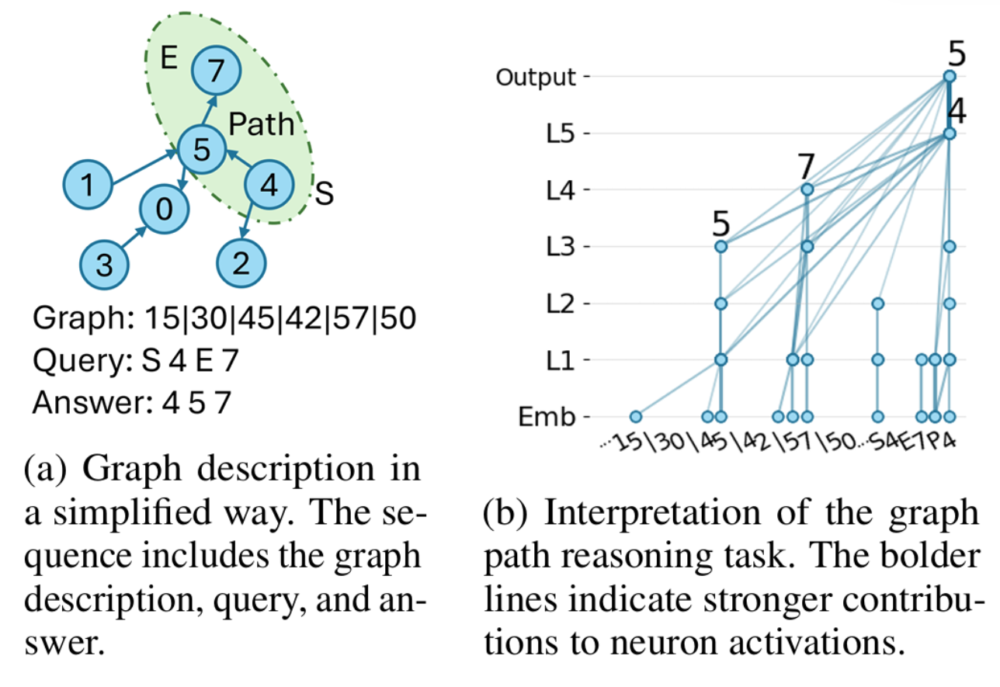

## Example code for decoder-only transformer on graph tasks and interpretation with circuit tracer

This is the code for [Uncovering Graph Reasoning in Decoder-only Transformers with Circuit Tracing](https://arxiv.org/abs/2509.20336) (Neurips 2025 Efficient Reasoning WorkShop Spotlight) and [GraphGhost: Tracing Structures Behind Large Language Models](https://arxiv.org/abs/2510.08613) (arxiv)

We provide a summary of the Circuit Tracer code to offer a simplified tutorial for constructing your own datasets and pretrained/finetuned models. 

We build this repo based on [nanoGPT (https://github.com/karpathy/nanoGPT)](https://github.com/karpathy/nanoGPT), [circuit_tracer (https://github.com/safety-research/circuit-tracer/tree/main)](https://github.com/safety-research/circuit-tracer/tree/main) and [transcoder_tracer (https://github.com/jacobdunefsky/transcoder_circuits/tree/master)](https://github.com/jacobdunefsky/transcoder_circuits/tree/master)

Here is the blog for this tutorial:
[English](https://ddigimon.github.io/posts/2025/11/blog-post-2/) [Chinese](https://zhuanlan.zhihu.com/p/1974770396768265587)

The code is divided into two part:

### 1. How do decoder-only transformers do the graph reasoning task?
> simplified_graph_task
> 
The simplified graph task offers a lightweight setting for applying circuit tracing. The entire pipeline can be executed on a single 24 GB GPU, (and reducing the number of layers or the maximum sequence length can further lower the resource requirements)

The codebase provides a basic pipeline for generating synthetic data and exploring Circuit Tracers within self-defined Transformer models (We use GPT-2 architecture as an example). We hope this pipeline will support future theoretical investigations into how LLMs internalize and reason about structured information.

We further illustrate how a decoder-only Transformer can interpret explicit graph structures. For example, given a graph represented as an edge list, we ask the model to identify a path from a start node (e.g., 4) to an end node (e.g., 7). After training, the Transformer can correctly output the path. However, as suggested in Figure (b), the model does not form a corresponding implicit structure that reflects the underlying graph topology.

To run the code, you can start with tutorial.ipynb, and view the visualization results in vis_example.ipynb.

Alternatively, you may run the full pipeline through the Python scripts:

Step1. generate data<pre>python generate_graphs.py</pre>
Step2. train your own transformer <pre>python train_graph_transformer.py</pre>
Step3. train your own circuit tracer <pre>python train_transcoders.py</pre>

Finally, you can open vis_example.ipynb to visualize the attribution graphs and reasoning traces.

### 2. How does the circuit tracers show on the pretrained LLMs?
>LLM_applications

We also apply circuit tracing to LLM reasoning tasks. In addition to interpreting how LLMs predict the next token, we first train the transcoder for the given dataset (tutorial.ipynb or train_transcoder.py) we further provide interpretations of:

How LLMs generate a chain of thought (analsyis.ipynb (Analysis1))

How LLMs organize and structure information from a given dataset (analsyis.ipynb (Analysis2))

How to perturb LLMs based on insights from the previous analyses (analsyis.ipynb (Analysis3 and Analysis4))

By modifying the source code, you can select any architecture listed in TransformerLens. [TransformerLens](https://transformerlensorg.github.io/TransformerLens/generated/model_properties_table.html). You can also load your own fine-tuned model by adjusting the model loading logic. (Refer to model_load to see how we load deepseek model)

----
Overall, our goal is to adopt a graph-based perspective to better understand—and ultimately control—the behaviors of LLMs.

----

Download Example model at: https://huggingface.co/DDigimon/graph_ghost_model
Download Example graphs at: https://huggingface.co/datasets/DDigimon/graph_ghost_data

----
Contact: daipigeon1[at]gmail

----
TODO:

1. Evaluation for transcoder training part
